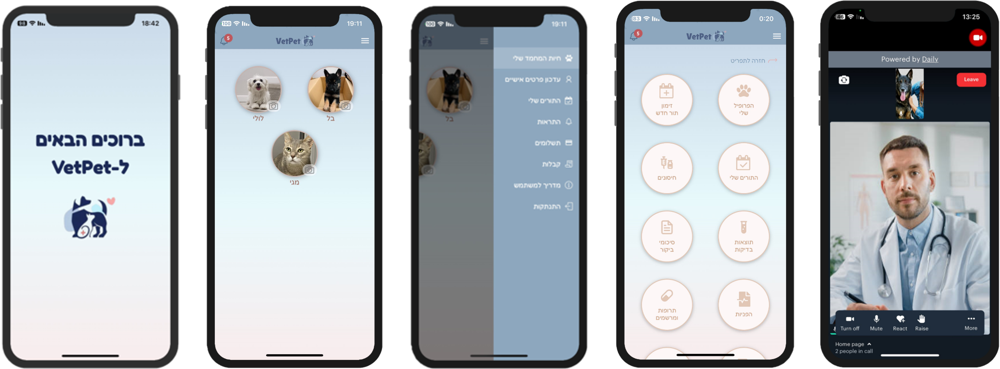
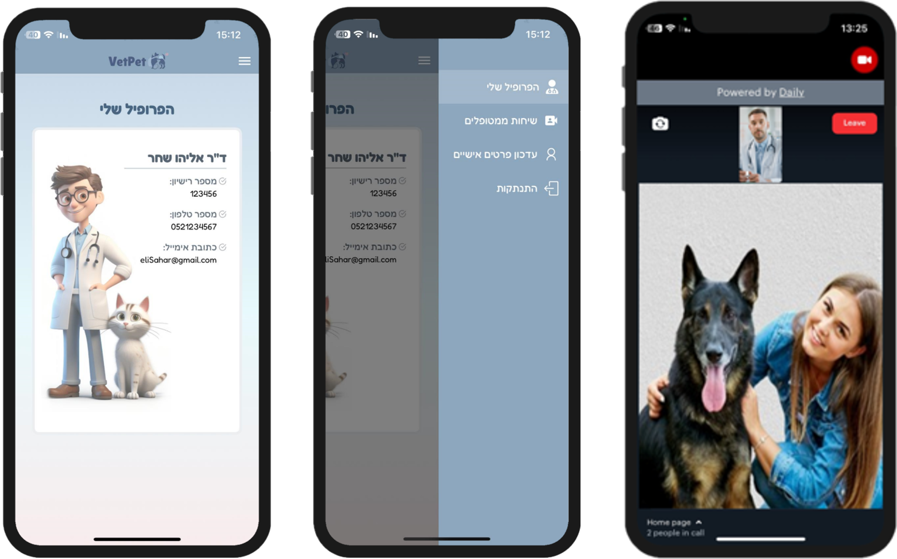

# VetPet Application

## Table of Contents

1. [Introduction](#introduction)
2. [Features](#features)
3. [Built With](#built-with)
4. [Installation](#installation)
5. [Environment Variables](#set-up-environment-variables)
6. [Database Setup](#database-setup)
7. [License](#license)
8. [Contributors](#contributors)
9. [Contact](#contact)

---

## Introduction

<div align="center">
   <h3 style="font-size: 28px; font-weight: bold;">
      VetPet - Pet Owners Application
      
   </h3>
   
</div>

<br>

<div align="center">
   <h3 style="font-size: 24px; font-weight: bold;">
      VetPetVideo - Veterinarians Application
      
   </h3>
   
</div>
<br>

VetPet is a comprehensive application intended for veterinary institutions and pet owners in Israel. It aims to bridge the gap in digital veterinary services by providing a comprehensive platform for pet health management. The application strengthens communication channels, centralizes health information, integrates proactive health management tools, and streamlines administrative processes. Key features include viewing visit summaries, managing appointments, payments, viewing receipts, tracking test results, vaccination records, viewing medications and prescriptions, referrals, and video calls with a veterinarian and more.

---

## Features

- **Pet Owners:**

  - **Pet Owners Menu:**

    - Secure Access
    - My Pet Owners Menu
    - Personal Details Management
    - My Appointments
    - Real-Time Alerts for:
      - Periodic Vaccinations
      - Upcoming Appointments
      - Payments
    - Manage Payments and Receipts
    - User Assistance Guide

  - **Each Pet Menu:**
    - My Profile
    - Appointments Management
    - Health Records:
      - Vaccinations
      - Test Results
      - Visit Summaries
      - Referrals
      - Medications and Prescriptions
    - Communication:
      - Chat with the Veterinary Institution
      - Video Call with a Veterinarian

- **Veterinarians:**
  - Secure Access
  - Manage Personal Details:
    - Update and View Profile
  - Communication:
    - Manage Video Calls with Pet Owners

---

## Built With

<table style="width: 100%; border-collapse: collapse;">
  <tr>
    <td style="border: none; text-align: center; padding: 10px;">
      
    </td>
    <td style="border: none; text-align: center; padding: 10px;">
      
    </td>
    <td style="border: none; text-align: center; padding: 10px;">
      
    </td>
  </tr>
  <tr>
    <td style="border: none; text-align: center; padding: 10px;">
      
    </td>
    <td style="border: none; text-align: center; padding: 10px;">
      
    </td>
    <td style="border: none; text-align: center; padding: 10px;">
      
    </td>
  </tr>
  <tr>
    <td style="border: none; text-align: center; padding: 10px;">
      
    </td>
    <td style="border: none; text-align: center; padding: 10px;">
      
    </td>
    <td style="border: none; text-align: center; padding: 10px;">
      
    </td>
  </tr>
</table>

---

## Installation

Follow these steps to set up the VetPet application:

#### 1. Clone the Repository

First, clone the repository to your local machine:

```bash
git clone https://github.com/Daniel-Elgarisi/VetPet.git
```

### 2. Backend Setup

Navigate to the backend folder and install the dependencies:

```bash
cd backend
npm install
```

- Set up the environment variables:
  - Follow the instructions in the [Set Up Environment Variables](#set-up-environment-variables) section.

Start the backend server:

```bash
node src/server
```

### 3. Frontend Setup

For the frontend, navigate to each folder (VetPet and VetPetVideo) and install dependencies:

**Important:** Before running the commands, update the `localNetworkIP` in the `config` files located at `frontend/VetPet/config` and `frontend/VetPetVideo/config`.

Replace the placeholder with your own local network IP:

```javascript
const localNetworkIP = "your_local_network_ip";
```

- VetPet:

```bash
cd frontend/VetPet
npm install
npx expo start
```

- VetPetVideo:

```bash
cd frontend/VetPetVideo
npm install
npx expo start
```

---

## Set Up Environment Variables

Create a `.env` file in the root directory of the `backend` folder and add the necessary environment variables as specified in the `.env.example` file.

1. **Locate the .env.example file:**

   The `.env.example` file can be found in the root directory of the `backend` folder.

2. **Copy the .env.example file and rename it to .env:**

   ```bash
   cp backend/.env.example backend/.env
   ```

3. **Fill in Your Environment Variables:**

   Open the `.env` file and fill in the necessary environment variables:

   - **Database credentials:**

     - `DB_USER`
     - `DB_PASSWORD`
     - `DB_HOST`
     - `DB_PORT`
     - `DB_DATABASE`

   - **Email credentials:**

     - `EMAIL_USER`
     - `EMAIL_PASSWORD`

   - **PayPal API credentials:**

     - `PAYPAL_CLIENT_ID`
     - `PAYPAL_CLIENT_SECRET`

   - **Stripe API secret key:**

     - `STRIPE_SECRET_KEY`

   - **Daily API key:**
     - `DAILY_API_KEY`

---

## Database Setup

To set up the database for the VetPet application, follow the instructions below.

#### Download the SQL Script

Here is the link to download the file:

[Download create_vetpet_database.sql](https://yourhostingservice.com/path/to/create_vetpet_database.sql)

#### How to Run the Script

To create the database using this script, the user can follow these steps:

1. **Open a terminal or command prompt**.

2. **Navigate to the directory where the `create_vetpet_database.sql` file is located**.

3. **Run the script using the following command**:

   ```bash
   psql -U [username] -d [database_name] -f create_vetpet_database.sql
   ```

   Replace `[username]` with the PostgreSQL username and `[database_name]` with the target database name.

4. **The script will execute and create the entire database schema**.

---

## License

This project is licensed under the MIT License - see the [LICENSE](LICENSE) file for details.

---

## Contributors

For a full list of contributors, see the [CONTRIBUTORS.md](CONTRIBUTORS.md) file.

---

## Contact

For any questions or support, please contact us at [vetpetapplication@gmail.com].
